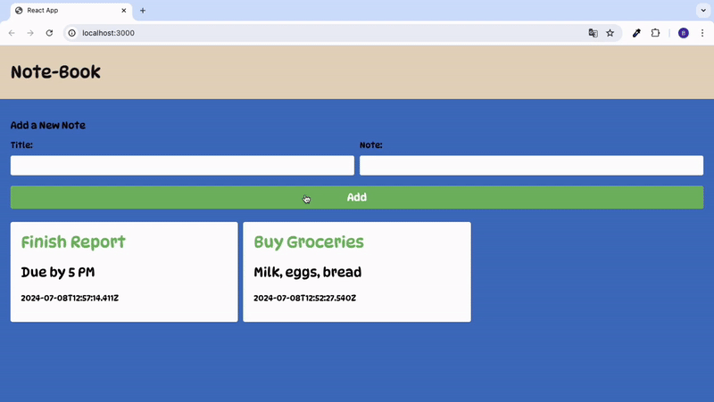

<h1>NOTE-BOOK</h1>

The MERN stack application "Note-Book" saves written notes to MongoDB. The backend is developed using libraries such as dotenv, express, and mongoose. The frontend is supported by technologies like react, react-dom, react-router-dom, and axios. It offers an effective note-taking experience with a user-friendly interface and reliable data management.

<h2> Software Languages </h2>

- HTML

- CSS

- JavaScript

<h2> Libraries </h2>

- React

- Express

- Mongoose

- Nodemon

- Axios

- React Router Dom

<h3> Minor Libraries </h3>

- Dotenv

<h2> Screen Gif </h2>

